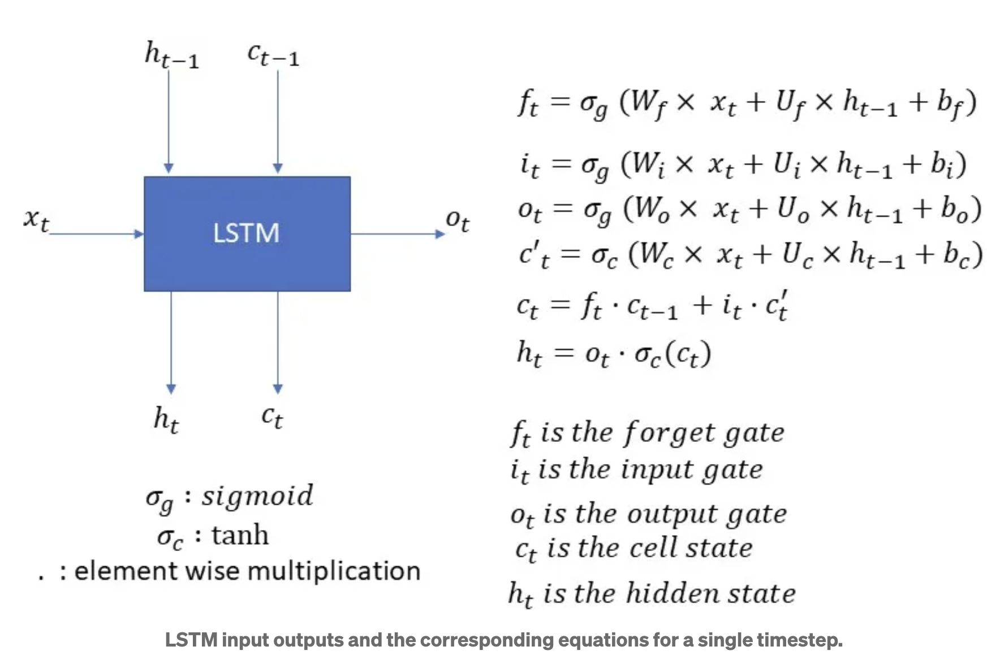
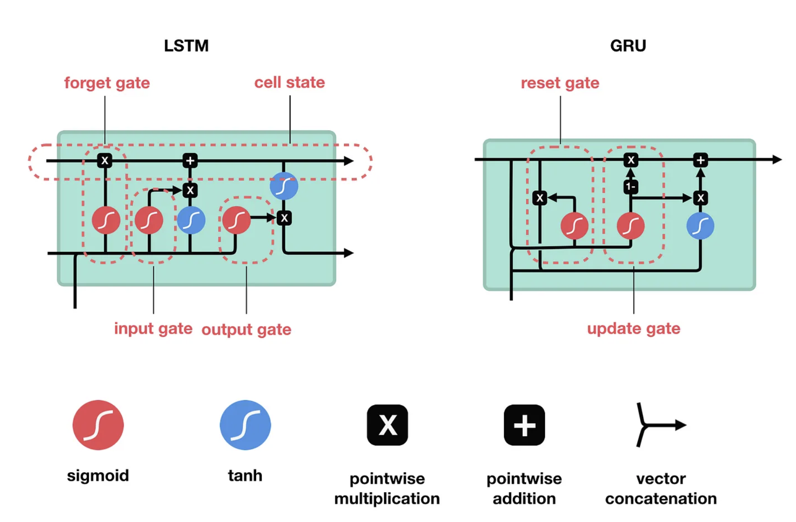
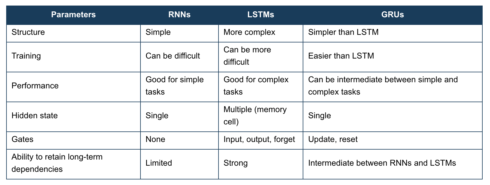
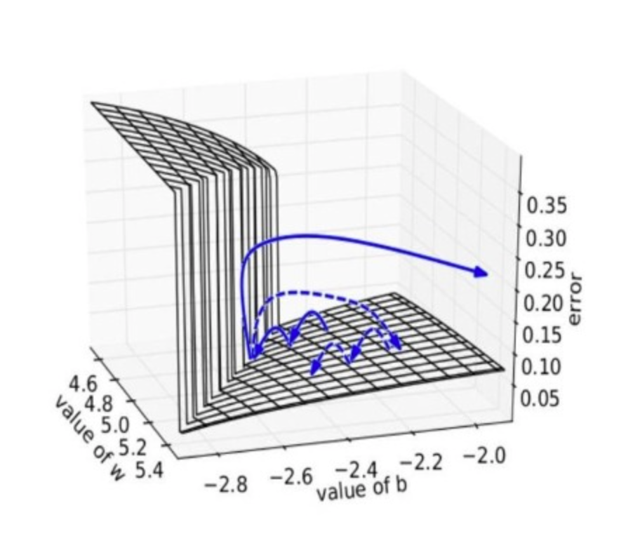
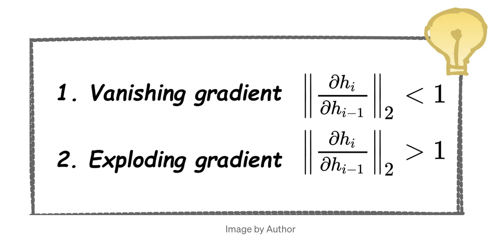
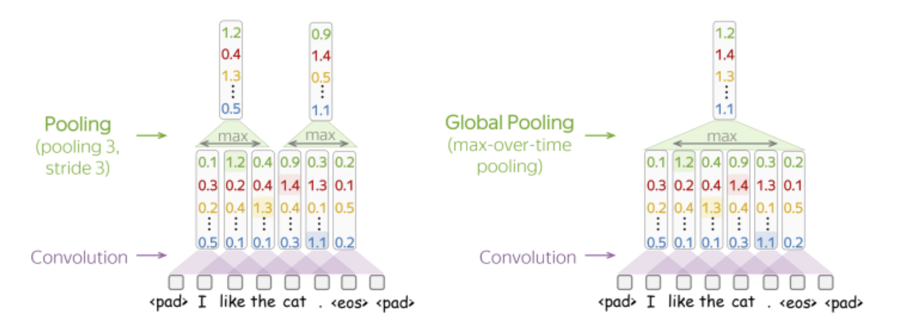
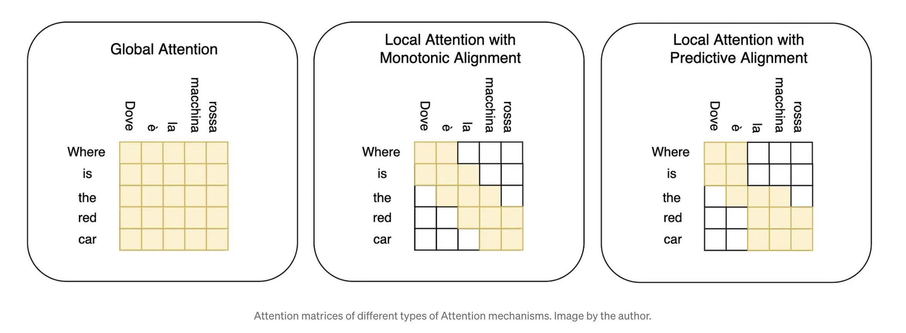

# 100 questions NLP (english)

*One of the cool honed skills is **asking questions**. Not knowing the answer is not bad; it's bad not even to Google it. Before the interview, copy this document to yourself.* 

**After answering a question, strike it out.** In the future, my answers will be here.

## CLASSIC NLP

- **TF-IDF  & ML (8/8)**
    - [ ]  1. Write **TF-IDF** from scratch.
        - ***answer***
            
            $$
            TfIdf(t, d, D) = Tf(t, d) * IDF(t, d)
            $$
            
            $$
            Tf = \frac{\text{Number of occurrences of term } t \text{ in document } d}{\text{Total number of terms in document } d}
            $$
            
            $$
            \text{IDF} = \log_e \left( \frac{\text{Total number of documents in the corpus}}{\text{Number of documents with term } t \text{ in them}} \right)
            
            $$
            
            $$
            TfIdf(t, d) = tf(t, d) * log(\frac{N}{df + 1})
            $$
            
            ```python
            # legit - https://www.askpython.com/python/examples/tf-idf-model-from-scratch
            
            import numpy as np
            from nltk.tokenize import  word_tokenize 
            from typing import List, Dict
            
            def create_counts(texts: List):
                sentences = []
                word_set = []
                
                for sent in texts:
                    # split into words / разбиваем пословно только слова
                    x = [i.lower() for  i in word_tokenize(sent) if i.isalpha()]
                    
                    sentences.append(x)
                    for word in x:
                        if word not in word_set:
                            word_set.append(word)
                
                # set a vocab of unique words / создаем словарь уникальных слов 
                word_set = set(word_set)
                total_documents = len(sentences)
             
                # Creating an index for each word in our vocab / каждому слову уникальный индекс 
                index_dict = {} 
                i = 0
                for word in word_set:
                    index_dict[word] = i
                    i += 1
                    
                return sentences, word_set, total_documents, index_dict
            
            def count_dict(sentences: List, word_set: set) -> Dict:
                """
                Counts of words.
                @sentences: the list of sentences 
                @word_set: all words without their unique ids
            
                return: frequencies of each word
                """
                word_count = {}
                for word in word_set:
                    word_count[word] = 0
                    for sent in sentences:
                        if word in sent:
                            word_count[word] += 1
                return word_count
            
            def termfreq(document: List, word: str) -> float:
                """
                Count the term frequency according to the formula 
                (num of term occurencies in the doc d) / (num of non-unique terms in doc d)
            
                @document: a list of words in the doc
                @word: a unique word
            
                return: TF value
                """
                # occurance = len([token for token in document if token == word])
                occurance = document.count(word)
                return occurance / len(document)
            
            def inverse_doc_freq(word: str, total_documents: int, word_count: Dict):
                """
                Count the IDF according to the formula
                log (num of docs / num of docs with term t)
            
                @word: a unique word
                @total_documents: num of docs in corpus
                @word_count: word frequencies {word: number of docs with word}
            
                return: IDF value
                """
                word_occurance = word_count.get(word, 0) + 1
                return np.log(total_documents / word_occurance)
            
            def tf_idf(sentence: List[str], vector_shape: int, index_dict: Dict, total_documents: int, word_count: Dict) -> np.array:
                """
                Get the sentence tf-idf vector
            
                @sentence: list of words in a sentence
                @vector_shape: number of unique words in corpus
                @index_dict: ids of words
                @total_documents: num of docs in corpus
                @word_count: word frequencies {word: number of docs with word}
            
                return: tf-idf vector as np.array
                """
                tf_idf_vec = np.zeros((vector_shape, ))
                for word in sentence:
                    tf = termfreq(sentence, word)
                    idf = inverse_doc_freq(word, total_documents, word_count)
                     
                    tf_idf_vec[index_dict[word]] = tf * idf 
                return tf_idf_vec
            
            def create_vectors(texts: List):
                vectors = []
                sentences, word_set, total_documents, index_dict = create_counts(texts)
                vector_shape = len(word_set)
                word_count = count_dict(sentences, word_set)
            
                for sent in sentences:
                    vec = tf_idf(sent, vector_shape, index_dict, total_documents, word_count)
                    vectors.append(vec)
            		vectors = np.array(vectors)
                return vectors, index_dict
            
            sentences = ['This is the first document.',
                    'This document is the second document.',
                    'And this is the third one.',
                    'Is this the first document?',]
            
            vectors, word2id = create_vectors(sentences)
            vectors.shape
            ```
            
    - [ ]  2. What is normalization in **TF-IDF**?
        - ***answer***
            
            TF-IDF normalization can be understood within the framework of the function itself. TF stands for term frequency in the document. In longer documents, TF values can be higher simply because there are more words in the document.
            
            *Normalization by document length allows us to consider a word like "cat," which appears 10 times in a 1000-word text, as important as a word like "cat" that appears 5 times in a 500-word text.*
            
            [Resource](https://www.quora.com/What-is-the-benefit-of-normalization-in-the-tf-idf-algorithm)
            
            In the TF-IDF vectorizer in sklearn, we can also use normalization after calculating all the scores. If we use l2 normalization, we can use cosine similarity between two vectors as a dot product.
            
            [Documentation](https://scikit-learn.org/stable/modules/generated/sklearn.feature_extraction.text.TfidfVectorizer.html)
            
            [Link to the post about tf-idf](https://t.me/grokaem_seby/118)
            
    - [ ]  3. Why do you need to know about **TF-IDF** in our time, and how can you use it in complex models?
        - ***answer***
            
            TF-IDF can be used for testing initial hypotheses about classification. It's a fast and simple way of text vectorization, so hypothesis testing will be very quick.
            
            Additionally, TF-IDF is used for feature extraction, as each value in the vectors can be seen as the importance of a word. Thus, we can use TF-IDF in:
            
            1. Topic modeling to extract the most important representations from a large number of words.
                - [Topic modelling](https://maartengr.github.io/BERTopic/getting_started/ctfidf/ctfidf.html)
            2. Utilizing it for classification alongside BERT-like models in various applications. For instance, adding it to the vector.
                - [Video](https://www.youtube.com/watch?v=NbbsVcs42jE&list=PLam9sigHPGwNx3cBUNwKSOGhda9u44Z03&index=4)
    - [ ]  4. Explain how Naive Bayes works. What can you use it for?
        - ***answer***
            
            Naive Bayes is a group of algorithms based on Bayes' theorem, which states:
            
            $$
            P(A|B) = \frac{P(B|A) \cdot P(A)}{P(B)}
            $$
            
            - *P*(*A*∣*B*) is the probability of hypothesis A given evidence B (posterior probability).
            - 𝑃(𝐵∣𝐴)*P*(*B*∣*A*) is the probability of evidence B given hypothesis A (likelihood).
            - 𝑃(𝐴)*P*(*A*) is the prior probability of hypothesis A.
            - 𝑃(𝐵)*P*(*B*) is the prior probability of evidence B.
            - example
                
                *Two batches of products arrived at the warehouse: the first – 4000 pieces, the second – 6000 pieces. The average percentage of non-standard products in the first batch is 20%, and in the second – 10%. A randomly selected product from the warehouse turned out to be standard. Find the probability that it is from the first batch.*
                
                $$
                P(B) = \frac{4000}{6000 + 4000} = 0.4 
                $$
                
                ***P(B) - probability that the product is from the first batch***
                
                ---
                
                $$
                P(A) = (1 - 0.2) * 0.4 + (1 - 0.1) * 0.6 = 0.32 + 0.54 = 0.86
                $$
                
                ***P(A) - the total probability that the product is standard***
                
                ---
                
                $$
                P(A|B) = \frac{P(B|A) \cdot P(A)}{P(B)} = \frac{P(standard - first batch) \cdot P(standard)}{P(first batch)} = \frac{ (1 - 0.2) \cdot 0.86}{0.4} = \frac {16}{43}
                $$
                
                [link](http://mathprofi.ru/formula_polnoj_verojatnosti_formuly_bajesa.html)
                
            
            **Most often, Naive Bayes is used for text classification, considering:**
            
            - Bag of Words assumption: word order does not matter.
            - Conditional Independence assumption: words are independent of each other.
            
            Examples:
            
            
            
            Additional question to consider: What if we haven't seen word x in document k? Then the probability will be 0, and the probability of the entire document will also be 0.
            
    - [ ]  5. How can SVM be prone to overfitting?
        - ***answer***
            
            For SVM, we can use various kernel functions, but using a too complex kernel function can lead to overfitting.
            
            In the classical case, instability to noise is also possible: one of the drawbacks may affect the separating hyperplane. Outliers in the training data become support vectors and directly influence the construction of the separating hyperplane.
            
            **Regularization**: The regularization parameter controls the balance between achieving high accuracy on training data and maintaining model simplicity. Too low a value can lead to overfitting.
            
            [Overview of SVM](https://www.analyticsvidhya.com/blog/2021/10/support-vector-machinessvm-a-complete-guide-for-beginners/) (VPN required)
            
            [Detailed explanation](https://habr.com/ru/companies/ods/articles/484148/)
            
    - [ ]  6. Explain possible methods for text preprocessing (**lemmatization** and **stemming**). What algorithms do you know for this, and in what cases would you use them?
        - ***answer***
            
            Lemmatization is the process of preparing data where a word is brought to its base dictionary form (root). For example, "doing," "went," "gone" → "go."
            
            On the other hand, stemming is also a text normalization process, but in this case, the ending of a word is removed until a certain form is formed. Various methods are used for this, such as SnowballStemmer, PorterStemmer, and others. A significant drawback is that the word after stemming may become unreal and may not be encountered elsewhere.
            
            [HyperSkill overview of Lemmatization](https://hyperskill.org/learn/step/31378#lemmatization-in-nltk)
            
            [HyperSkill overview of Stemming](https://hyperskill.org/learn/step/31367)
            
            ```python
            pythonCopy code
            from nltk.stem import WordNetLemmatizer
            
            lemmatizer = WordNetLemmatizer()
            lemmatizer.lemmatize('playing')  # playing
            
            ```
            
    - [ ]  7. What metrics for text similarity do you know?
        - ***answer***
            
            In custom tasks, we can divide metrics for text similarity into two types: lexical and semantic.
            
            Lexical examples: Jaccard similarity.
            
            Semantic examples: cosine similarity, Euclidean distance.
            
            ```python
            def cosine_similarity(vec1, vec2):
                """Computes the cosine similarity between two vectors."""
                dot_product = np.dot(vec1, vec2)
                norm_vec1 = np.linalg.norm(vec1)
                norm_vec2 = np.linalg.norm(vec2)
                return dot_product / (norm_vec1 * norm_vec2)
            
            def cosine_distance(vec1, vec2):
                """Computes the cosine distance between two vectors."""
                return 1.0 - cosine_similarity(vec1, vec2)
            
            def euclidean_distance(vec1, vec2):
                """Computes the Euclidean distance between two vectors."""
                return np.sqrt(np.sum((vec1 - vec2) ** 2))
            
            def manhattan_distance(vec1, vec2):
                """Computes the Manhattan distance between two vectors."""
                return np.sum(np.abs(vec1 - vec2))
            
            def jaccard_index(set1, set2):
                """Computes the Jaccard index between two sets."""
                intersection = len(set1.intersection(set2))
                union = len(set1.union(set2))
                return intersection / union if union != 0 else 0
            
            ```
            
            [Help in the response](https://t.me/toshoseti)
            
            [HyperSkill overview](https://hyperskill.org/learn/step/22997#step-title)
            
    - [ ]  8. Explain the difference between **cosine similarity** and cosine distance. Which of these values can be negative? How would you use them?
        - ***answer***
            
            Cosine similarity/distance is a metric that indicates how similar or dissimilar two vectors (embeddings) are to each other. Essentially, it measures the angle between two vectors.
            
            **Cosine similarity range, -1 to 1:**
            -1: Absolutely dissimilar vectors *(e.g., python - security of code)*
            0: No correlation *(e.g., university knowledge - work)*
            1: Absolutely similar *(e.g., chatgpt - hype)*
            
            **Cosine distance = 1 - cosine similarity**
            
            **Range 0 to 2:**
            0: Identical vectors
            1: No correlation
            2: Absolutely different
            
            Cosine similarity - how similar vectors are
            Cosine distance - how dissimilar they are
            
- **METRICS (7/7)**
    - [ ]  9. Explain precision and recall in simple words and what you would look at in the absence of F1 score?
        - ***answer***
            
            For simplicity, let’s use this confusion matrix as a basis:
            
            
            
            - **precision** = How much can we trust the prediction of pregnancy?
            - **recall** = Out of all pregnant women, how many did we actually guess correctly?
            
            $$
            \text{Recall} = \frac{\text{TP}}{\text{TP + FN}}
            $$
            
            $$
            \text{Precision} = \frac{\text{TP}}{\text{TP + FP}}
            
            $$
            
            So, for us, precision is a measure where we don’t want to include anything extra (for example, a couple of pregnant men), while recall is a measure so that we don’t classify all women as pregnant indiscriminately. In the case of a perfect classifier, we won’t have any pregnant men or incorrect diagnoses.
            
            If the outcomes of the classifier don’t cost us much money/moral convictions, then we can afford to lose in precision. For example, when we have small costs for potential clients, and we are ready to offer our services not directly to the target audience.
            
            The balance between these two metrics can be maintained through the F1 score.
            
    - [ ]  10. In what case would you observe changes in **specificity**?
        - ***answer***
            - **Sensitivity** = tp / (tp + fn) — the number of sick patients correctly identified as sick compared to the total number of sick patients but classified as healthy
            - **Specificity** = tn / (fp + tn) — the number of healthy patients classified as healthy compared to the total number of healthy patients, including those classified as sick
            
            Essentially, sensitivity is recall: how well the model detects sick patients. Specificity is also recall, but concerning the negative class, how well the model detects healthy patients.
            
            In short:
            
            - Recall — the proportion of sick class objects detected by the algorithm out of all sick individuals
            - Specificity — the proportion of healthy class objects detected by the algorithm out of all healthy individuals
            - Precision — how many truly sick individuals the algorithm identified out of all those it labeled as sick
            
            Roughly speaking, we have different denominators: in the case of recall and specificity, we divide by what is actually in the data; in precision, we divide by the number of examples given by the model.
            
            So, the question of when we would look at **specificity arises when it’s important for us to correctly determine the negative class**. For example, when we want to administer medication to everyone identified as sick by the model, but the medication has many side effects, so we want to perfectly identify healthy patients.
            
    - [ ]  11. When would you look at macro, and when at micro metrics? Why does the weighted metric exist?
        - ***answer***
            - **Macro** metrics are calculated separately for each class and then averaged. This is useful when all classes are equally important.
            - **Micro** metrics are calculated based on the sum of all true positives, false positives, and false negatives. This is useful when individual predictions matter. With micro-average, you can see the impact of class imbalance.
            - **Weighted** metrics are used when classes are unbalanced, and you want to consider the number of samples in each class when calculating the average.
            
            Examples of calculation:
            
            
            
            As the figure shows, a micro-average is dominated by the more frequent class (in this case, spam), since the counts are pooled. The macro-average better reflects the statistics of the smaller classes, and so is more appropriate when performance on all the classes is equally important.
            
    - [ ]  12. What is perplexity? What can we consider it with?
        - ***answer***
            
            Perplexity is the confusion a model experiences when generating a new sentence. For example, when you are fluent in a language, you don’t struggle to choose the right word, but as a beginner, you may need to try several options and look them up in a dictionary. Similarly, with a language model.
            
            Perplexity is an intrinsic metric, as it doesn’t denote the performance on a specific task but simply indicates ‘how good the language is’.
            
            Mathematically, you can compute the metric through:
            
            - Probability on the test set, meaning how confidently the model performs on the test data
            - Exponential cross-entropy — here, following the same scheme of the number of words among which the model chooses or the weighted branching factor. An excellent article on computation.
            
            Rule: the lower the perplexity, the better, interpreted as ‘the less the model hesitates, the better’.
            
            How to compute it? [post](https://t.me/grokaem_seby/157)
            
    - [ ]  13. What is the **BLEU** metric?
        - ***answer***
            
            BLEU (Bilingual Evaluation Understudy) is a metric for evaluating machine translation. It compares machine-translated text to one or more reference translations, taking into account the accuracy of word choice and grammatical correctness.
            
            $$
            p_n = \frac{\sum_{\text{n-gram} \in \text{hypothesisCountmatch}} \text{match}(n\text{-gram})}{\sum_{\text{n-gram} \in \text{hypothesisCount}} \text{match}(n\text{-gram)}}
                 = \frac{\sum_{\text{n-gram} \in \text{hypothesisCountmatch}} \ell_{\text{n-gram}}^\text{hyp}}{\sum_{\text{n-gram} \in \text{hypothesisCount}} \ell_{\text{n-gram}}^\text{hyp}}
            
            $$
            
            According to the formula, BLEU calculates the ratio of matching n-grams to all n-grams in the hypothesis (generated text).
            The final formula is a weighted average over different types of n-grams, taking into account BP - brevity penalty. This parameter allows limiting hypotheses (generated texts) longer than the source text. However, for translation tasks, this is not always relevant.
            The function for n-gram word precision across all sentences combined with brevity penalty.
            
            $$
            \text{BLEU}_N = \text{BP} \cdot \exp\left(\sum_{n=1}^{N} w_n \log p_n\right)
            $$
            
            $$
            \text{BP} = \begin{cases}1 & \text{if } \ell_{\text{hyp}} > \ell_{\text{ref}} \\e^{1 - \frac{\ell_{\text{ref}}}{\ell_{\text{hyp}}}} & \text{if } \ell_{\text{hyp}} \leq \ell_{\text{ref}}\end{cases}
            $$
            
            Constraints: Because BLEU is a word-based metric, it is very sensitive to word tokenization, making it impossible to compare different systems if they rely on different tokenization standards, and doesn’t work as well in languages with complex morphology.
            
            [Video hugging face](https://www.youtube.com/watch?v=M05L1DhFqcw)
            
            [Original paper](https://aclanthology.org/P02-1040.pdf)
            
    - [ ]  14. Explain the difference between different types of **ROUGE** metrics?
        - ***answer***
            
            [video explanation](https://www.google.com/search?q=rouge+metrics&rlz=1C5CHFA_enRU1054RU1054&oq=rouge+metrics+&gs_lcrp=EgZjaHJvbWUyCggAEEUYFhgeGDkyBwgBEAAYgAQyBwgCEAAYgAQyCAgDEAAYFhgeMggIBBAAGBYYHjIICAUQABgWGB4yCAgGEAAYFhgeMggIBxAAGBYYHjIICAgQABgWGB4yCAgJEAAYFhge0gEINTk5MWowajeoAgCwAgA&sourceid=chrome&ie=UTF-8#fpstate=ive&vld=cid:af70f45b,vid:TMshhnrEXlg,st:0)
            
            [paper](https://aclanthology.org/W04-1013.pdf) 
            
            - **ROUGE-N**
                
                ROUGE 1 - F1 score for the matching words in the candidate and reference. ROUGE - 2 - the same but for bigrams. ROUGE-N - the N-gram overlap between candidate and references.  
                
                Precision - n-grams in the prediction that are also in the reference
                
                Recall - n-grams in the reference that are also in the prediction. 
                
                **Why important to take recall?** 
                Consider the generated example “I really really loved reading reading the Hunger Games”. The recall will be perfect, however it is not the best candidate for us. 
                
                $$
                \text{ROUGE-1}_{\text{F1}}=2*\frac{\text{recall}*\text{precision}}{\text{recall} + \text{precision}}
                $$
                
                $$
                \text{ROUGE-1}_{\text{precision}}= \frac{\text{unigram cand. } \cap \text{ unigram ref.}}{|\text{unigram cand.}|}
                $$
                
                $$
                \text{ROUGE-1}_{\text{recall}} = \frac{\text{unigram cand. } \cap \text{ unigram ref.}}{|\text{unigram ref.}|}
                $$
                
                
                
                **Rouge-1 example calculation:**
                
                $$
                \text{ROUGE-1}_{\text{recall}} = \frac{\text{unigram cand. } \cap \text{ unigram ref.}}{|\text{unigram ref.}|} = \frac{\text{I, loved, reading, the, Hunger, Games}} {|\text{ len(references)}|} = \frac{6} {6}
                $$
                
                $$
                \text{ROUGE-1}_{\text{precision}} = \frac{\text{unigram cand. } \cap \text{ unigram ref.}}{|\text{unigram ref.}|} = \frac{\text{I, loved, reading, the, Hunger, Games}} {|\text{ len(candidate)}|} = \frac{6} {7}
                $$
                
                $$
                \text{ROUGE-1}_{\text{F1}}=2*\frac{\text{recall}*\text{precision}}{\text{recall} + \text{precision}} = \frac{12} {13}
                $$
                
            - **ROUGE-L**
                
                ROUGE-L measures the **longest common subsequence (LCS - the sequence in the same order but not necessarily continuous)** between the candidate text and the reference text. It computes the precision, recall, and F1-score based on the length of the LCS. 
                
                Can be extended with ROUGE-W, that assigns more weight to consecutive LCSes. 
                
                $$
                \text{ROUGE-L}_{\text{recall}} = \frac{\text{LCS}(\text{cand., ref.})}{\text{\#words in ref.}}
                $$
                
                $$
                \text{ROUGE-L}_{\text{precision}} = \frac{\text{LCS}(\text{cand., ref.})}{\text{\# words in cand.}}
                $$
                
                $$
                \text{ROUGE-L}_{\text{F1}} = 2*\frac{\text{recall}*\text{precision}}{\text{recall} + \text{precision}}
                $$
                
                LCS in the example above is “I loved reading the Hunger Games”, length of the LCS is 6. 
                
                So, 
                
                $$
                \text{ROUGE-L}_{\text{recall}} = \frac{\text{unigram cand. } \cap \text{ unigram ref.}}{|\text{unigram ref.}|} = \frac{\text{LCS}} {|\text{ len(references)}|} = \frac{6} {6}
                $$
                
                $$
                \text{ROUGE-L}_{\text{precision}} = \frac{\text{unigram cand. } \cap \text{ unigram ref.}}{|\text{unigram ref.}|} = \frac{\text{I, loved, reading, the, Hunger, Games}} {|\text{ len(candidate)}|} = \frac{6} {7}
                $$
                
                $$
                \text{ROUGE-L}_{\text{F1}}=2*\frac{\text{recall}*\text{precision}}{\text{recall} + \text{precision}} = \frac{12} {13}
                $$
                
            - **ROUGE-Skip gram**
                
                ROUGE-S is a skip-gram concurrence metric: it considers n-grams that appear in the reference text and allows the words **to be separated by one** or more words in the model output (but they must still appear in order).
                
                N - number of unigrams to skip 
                
                For example:
                *Police killed the gunman - gives such skip-grams: (“police killed”, “police the”, “police gunman”, “killed the”, “killed gunman”, “the gunman”) N = 2* 
                
                Then we calculate the same skip-grams for generated summaries and make the same calculation. 
                
            
            **Calculation:**
            
            ```python
            import evaluate
            
            rouge = evaluate.load('rouge')
            
            predictions = ["I really really loved reading reading the Hunger Games", 
            						"Police killed the gunman"]
            references = ["I really loved reading  the Hunger Games",
            						"the gunman killed the police"]
            results = rouge.compute(predictions=predictions, references=references)
            
            # {'rouge1': 0.8819444444444445,
            #  'rouge2': 0.7142857142857143,
            #  'rougeL': 0.6597222222222223,
            #  'rougeLsum': 0.6597222222222223}
            ```
            
    - [ ]  15. What is the difference between BLUE and ROUGE?
        - ***answer***
            
            **BLEU** (Bilingual Evaluation Understudy) - a metric commonly used in translation tasks. BLEU measures the similarity between a translated text and a reference translation. It often calculates n-gram values, comparing two texts.
            
            **ROUGE** (Recall-Oriented Understudy for Gisting Evaluation) - a metric for summarization tasks. It also compares two texts (generated summary and source summary), based on the number of overlapped n-grams.
            
            Both metrics rely on overlapping n-grams.
            The key difference is that BLEU is precision orientated and ROUGE is recall orientated, these differences are based on the metrics common usage.
            
- **WORD2VEC(9)**
    - [ ]  16. Explain how **Word2Vec** learns? What is the loss function? What is maximized?
    - [ ]  17. What methods of obtaining embeddings do you know? When will each be better?
    - [ ]  18. What is the difference between static and contextual embeddings?
    - [ ]  19. What are the two main architectures you know, and which one learns faster?
    - [ ]  20. What is the difference between Glove, ELMO, FastText, and **Word2Vec**?
    - [ ]  21. What is negative sampling and why is it needed? What other tricks for Word2Vec do you know, and how can you apply them?
    - [ ]  22. What are dense and sparse embeddings? Provide examples.
    - [ ]  23. Why might the dimensionality of embeddings be important?
    - [ ]  24. What problems can arise when training **Word2Vec** on short textual data, and how can you deal with them?
- **RNN & CNN(7/7)**
    - [ ]  25. How many training parameters are there in a simple 1-layer **RNN**?
        - ***answer***
            
            Example calculation: [excellent article](https://towardsdatascience.com/tutorial-on-lstm-a-computational-perspective-f3417442c2cd#b10c)
            
            
            
            Let’s take a single layer RNN network as an example. In it, we have gates. Each gate has weight matrices 
            
            $$
            W_f, W_i, W_o, W_c
            $$
            
            f - forget, i - input, o - output, c - cell 
            
            All these matrices are time-independent, meaning that each matrix is used at all stages for all input timesteps. 
            
            The number of weights is therefore calculated as following:
            
            $$
            weights = 4 * outputdim * inputdim + 4 * outputdim * outputdim + 4 *outputdim
            $$
            
    - [ ]  26. How does RNN training occur?
        - ***answer***
            
            At each time-step of RNN we do an update of the hidden state. If at this time-step we have a true target y_t (like in text generation), we calculate the loss for this time-step. Then at the end of the final loss we do backpropagation through time-unroll over the time. 
            
            
            
            For each time-step t:
            
            1. Input x_t is given to RNN. 
            2. New hidden state h_t is calculated based on h_(t-1) and current x_t
            3. New output y_t is calculated. 
            
    - [ ]  27. What problems exist in RNN?
        - ***answer***
            1. **Vanishing gradient over time** - refers to the main challenge in using RNNs—the problem of solving long-term dependencies. However, when performing backpropagation through time, the gradient does not reach the initial time steps in long sequences.
            2. **Longer training - parallelization methods are not easily applicable** 
                
                > *Recurrent models typically factor computation along the symbol positions of the input and output sequences. Aligning the positions to steps in computation time, they generate a sequence of hidden states ht as a function of the previous hidden state h(t-1). This inherently sequential nature precludes parallelization within training examples, which becomes critical at longer sequence lengths, as memory constraints limit batching across examples.*
                > 
    - [ ]  28. What types of RNN networks do you know? Explain the difference between GRU and LSTM?
        - ***answer***
            
            LSTM and GRU are the main variants of RNN. They are more complex as they use more gates. 
            
            
            
            - **vanilla RNN -** update without any gates
            ****[code, math example](https://calvinfeng.gitbook.io/machine-learning-notebook/supervised-learning/recurrent-neural-network/recurrent_neural_networks)
            - **LSTM**
                
                It has three main gates: input, forget and output gate. 
                
                **forget gate** - information from the previous hidden state and information from the current input is passed through the sigmoid function. Values come out between 0 and 1. The closer to 0 means to forget, and the closer to 1 means to keep. 
                
                1. updates the cell state 
                2. decided what info should be thrown away or kept 
                3. given hidden state and current 
                
                After we have thrown unnecessary info away, we can add new info. 
                
                **input gate -** decided what info should be added to the cell state 
                
                1. updates the cell state given the previous 
                2. given hidden state and the current input. 
                
                **output gate** - The output gate decides what the next hidden state should be based on the previous hidden state, current input and modified cell state. 
                
                Remember that the hidden state contains information on previous inputs. The hidden state is also used for predictions. 
                
            
            GRU 
            
            merges forget and input gate as an update gate 
            
            *At each time step, the GRU computes a “candidate activation vector” that combines information from the input and the previous hidden state. This candidate vector is then used to update the hidden state for the next time step.*
            
            - update gate - forget + input gate → what info to throw away from the current info and what info to add
            - reset gate - how much of the previous hidden state to forget according to the current input - how much the previous hidden state is reset.
            
            В GRU мы объединили единое скрытое состояние для передачи информации, в то время как у LSTM было два состояния: отдельное ячейки и общее скрытое состояние. 
            Таким образом, GRU имеет меньше параметров и часто обучается быстрее. 
            
            
            
            [comparison table link](https://www.shiksha.com/online-courses/articles/rnn-vs-gru-vs-lstm/#:~:text=GRUs%20are%20simplified%20version%20of,and%20accessing%20long%2Dterm%20dependencies.)
            
            [visualized guide](https://towardsdatascience.com/illustrated-guide-to-lstms-and-gru-s-a-step-by-step-explanation-44e9eb85bf21) 
            
    - [ ]  29. What parameters can we tune in such networks? (Stacking, number of layers)
        - ***answer***
            1. Number of layers 
            2. Bi-directional or not 
            3. Number of hidden units 
    - [ ]  30. What are vanishing gradients for RNN? How do you solve this problem?
        - ***answer***
            
            The vanishing gradient problem means that the gradient becomes very small, making it difficult to update the parameters significantly enough to learn anything. On the other hand, the exploding gradient problem refers to the opposite situation, where the gradient becomes too large, causing the optimization to “overshoot” the minimum of the loss function.
            
            
            
            
            
            To address the problem, we can use more advanced networks like LSTM and GRU, as well as methods applicable to other types of networks:
            
            •	**Gradient Clipping**
            
            •	**Activation Functions**: Replace ReLU with LeakyReLU or other alternatives.
            
            > ReLU suffers from a problem known as *dying ReLUs*, where some neurons stop working and consistently output 0 as training progresses. [source](https://www.analyticsvidhya.com/blog/2021/06/the-challenge-of-vanishing-exploding-gradients-in-deep-neural-networks/)
            > 
            
            •	**Batch Normalization**
            
    - [ ]  31. Why use a Convolutional Neural Network in NLP, and how can you use it? How can you compare CNN within the attention paradigm?
        - ***answer***
            
            CNNs can process text using a sliding window, which allows them to capture local patterns. This makes CNNs useful for extracting local features, such as n-grams.
            
            
            
            https://arc.net/l/quote/mwdycwik
            
            [best explanation ever](https://arc.net/l/quote/mwdycwik)
            
            [link](https://medium.com/nlplanet/two-minutes-nlp-visualizing-global-vs-local-attention-c61b42758019)
            
            
            

# **NLP and TRANSFORMERS**

- **ATTENTION AND TRANSFORMER ARCHITECTURE (15)**
    - [ ]  32. How do you compute **attention**? (additional: for what task was it proposed, and why?)
    - [ ]  33. Complexity of attention? Compare it with the complexity in RNN.
    - [ ]  34. Compare RNN and **attention**. In what cases would you use attention, and when RNN?
    - [ ]  35. Write attention from scratch.
    - [ ]  36. Explain masking in attention.
    - [ ]  37. What is the dimensionality of the self-attention matrix?
    - [ ]  38. What is the difference between **BERT** and **GPT in terms of attention calculation**?
    - [ ]  39. What is the dimensionality of the embedding layer in the transformer?
    - [ ]  40. Why are embeddings called contextual? How does it work?
    - [ ]  41. What is used in transformers, **layer norm** or **batch norm**, and why?
    - [ ]  42. Why do transformers have **PreNorm** and **PostNorm**?
    - [ ]  43. Explain the difference between **soft** and **hard** (local/global) attention?
    - [ ]  44. Explain multihead attention.
    - [ ]  45. What other types of attention mechanisms do you know? What are the purposes of these modifications?
    - [ ]  46. How does self-attention become more complex with an increase in the number of heads?
- **TRANSFORMER MODEL TYPES (7)**
    - [ ]  47. Why does BERT largely lag behind **RoBERTa**, and what can you take from RoBERTa?
    - [ ]  48. What are **T5** and **BART** models? How do they differ?
    - [ ]  49. What are **task-agnostic** models? Provide examples.
    - [ ]  50. Explain transformer models by comparing BERT, GPT, and T5.
    - [ ]  51. What major problem exists in BERT, GPT, etc., regarding model knowledge? How can this be addressed?
    - [ ]  52. How does a decoder-like GPT work during training and inference? What is the difference?
    - [ ]  53. Explain the difference between heads and layers in transformer models.
- **POSITIONAL ENCODING (6)**
    - [ ]  54. Why is information about positions lost in embeddings of transformer models with attention?
    - [ ]  55. Explain approaches to positional embeddings and their pros and cons.
    - [ ]  56. Why can't we simply add an embedding with the token index?
    - [ ]  57. Why don't we train positional embeddings?
    - [ ]  58. What is **relative** and **absolute** positional encoding?
    - [ ]  59. Explain in detail the working principle of **rotary** positional embeddings.
- **PRETRAINING (4)**
    - [ ]  60. How does **causal language modeling** work?
    - [ ]  61. When do we use a pretrained model?
    - [ ]  62. How to train a transformer from scratch? Explain your pipeline, and in what cases would you do this?
    - [ ]  63. What models, besides BERT and GPT, do you know for various pretraining tasks?
- **TOKENIZERS (9)**
    - [ ]  64. What types of **tokenizers** do you know? Compare them.
    - [ ]  65. Can you extend a tokenizer? If yes, in what case would you do this? When would you retrain a tokenizer? What needs to be done when adding new tokens?
    - [ ]  66. How do regular tokens differ from **special** tokens?
    - [ ]  67. Why is lemmatization not used in transformers? And why do we need tokens?
    - [ ]  68. How is a tokenizer trained? Explain with examples of **WordPiece** and **BPE**.
    - [ ]  69. What position does the CLS vector occupy? Why?
    - [ ]  70. What tokenizer is used in BERT, and which one in GPT?
    - [ ]  71. Explain how modern tokenizers handle out-of-vocabulary words?
    - [ ]  72. What does the tokenizer vocab size affect? How will you choose it in the case of new training?
- **TRAINING (8)**
    - [ ]  73. What is class imbalance? How can it be identified? Name all approaches to solving this problem.
    - [ ]  74. Can dropout be used during inference, and why?
    - [ ]  75. What is the difference between the Adam optimizer and AdamW?
    - [ ]  76. How do consumed resources change with gradient accumulation?
    - [ ]  77. How to optimize resource consumption during training?
    - [ ]  78. What ways of distributed training do you know?
    - [ ]  79. What is textual augmentation? Name all methods you know.
    - [ ]  80. Why is padding less frequently used? What is done instead?
    - [ ]  81. Explain how warm-up works.
    - [ ]  82. Explain the concept of gradient clipping?
    - [ ]  83. How does teacher forcing work, provide examples?
    - [ ]  84. Why and how should skip connections be used?
    - [ ]  85. What are adapters? Where and how can we use them?
    - [ ]  86. Explain the concepts of metric learning. What approaches do you know?
- **INFERENCE (4)**
    - [ ]  87. What does the temperature in softmax control? What value would you set?
    - [ ]  88. Explain types of sampling in generation? top-k, top-p, nucleus sampling?
    - [ ]  89. What is the complexity of beam search, and how does it work?
    - [ ]  90. What is sentence embedding? What are the ways you can obtain it?
- **LLM (13)**
    - [ ]  91. How does **LoRA** work? How would you choose parameters? Imagine that we want to fine-tune a large language model, apply LORA with a small R, but the model still doesn't fit in memory. What else can be done?
    - [ ]  92. What is the difference between **prefix tuning**, **p-tuning**, and **prompt tuning**?
    - [ ]  93. Explain the **scaling law**.
    - [ ]  94. Explain all stages of LLM training. From which stages can we abstain, and in what cases?
    - [ ]  95. How does **RAG** work? How does it differ from few-shot KNN?
    - [ ]  96. What quantization methods do you know? Can we fine-tune quantized models?
    - [ ]  97. How can you prevent catastrophic forgetting in LLM?
    - [ ]  98. Explain the working principle of **KV cache**, **Grouped-Query Attention**, and **MultiQuery Attention**.
    - [ ]  99. Explain the technology behind MixTral, what are its pros and cons?
    - [ ]  100. How are you? How are things going?
- **ANALYSE questions additional**
    1. Name the most important trends in NLP in your opinion.
    2. A generative decoder-only model has learned some "bad" patterns in the data. As a result, it sometimes generates "bad" texts. How can you prevent it from generating them? (The question is intentionally broad. For an intern/junior, 1-2 hypotheses, for a mid-level, 2-3 possible approaches, for a senior, 4-5 approaches with an analysis of their advantages and disadvantages)
    3. Suppose we need to train a classifier on k classes, and there are only 10 labeled examples for each. How would you approach this? It is assumed that either the candidate will talk more about synthetic data, how to generate it, etc., or ideally, about few-shot learning.
    4. Is it possible for a model to give a probability of a certain class as 90%+, but still make a mistake?
    5. What is the last article you read?